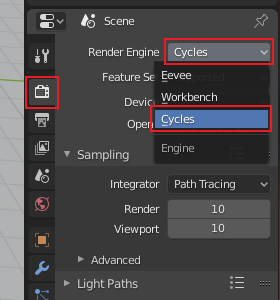

## Challenge: different settings

+ Try selecting different resolutions from the **Render presets** menu and see how this changes the file size and the time it Blender needs to render the scene.

+ Try rendering the scene in **Cycles Render** mode by selecting it from the menu at the top of the screen.

Most professionals use this mode, but it can be really slow as it uses **ray tracing**. Ray tracing simulates the how light rays bounce around the scene. You can get super realistic images this way, but using **Cycles Render** mode requires a lot of computing power, so you might need to buy a very expensive graphics card to make it work on your computer.