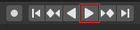

## Check your animation

For this project you will need the animation you created with the [Animate a snow scene](https://projects.raspberrypi.org/en/projects/blender-animate-snow-scene){:target="_blank"} resource. If you have not completed this resource, you can download and use the [starter snow scene](resources/starter-snow-scene.blend){:target="_blank"} instead.

--- task ---

Play your animation by clicking the **Play** icon or by moving the bar on the timeline at the bottom of the screen. Do you like how it looks?

--- /task ---
 
--- task ---

Check whether the camera is in the right location by going to render view: click ‘Render Image’ in the ‘Render’ menu.

--- /task ---

You can also check what the full animation will look like from the **camera's** position.

--- task ---

Select **View** > **Cameras** from the menu, then select **Active camera**.

Be careful to use the view menu nearest the editor window and **not** the one right at the bottom of the screen (marked with an X in the screenshot above).

--- /task ---

--- task ---

Click the **Play** icon to play the animation as seen through the camera.

--- /task ---

--- task ---

Exit the view by selecting the **Active camera** menu option again.

--- /task ---

If you are happy with the animation and everything looks fine from the camera's perspective, then you are ready to render your scene.
