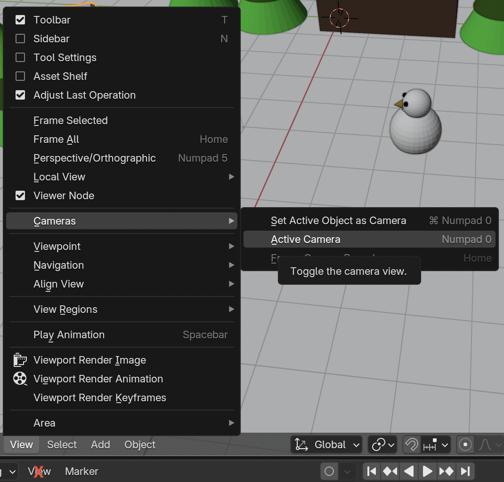

## Check your animation

For this project you will need the animation you created with the [Animate a snow scene](https://projects.raspberrypi.org/en/projects/blender-animate-snow-scene){:target="_blank"} resource. If you have not completed this resource, you can download and use the [starter snow scene](resources/starter-snow-scene.blend){:target="_blank"} instead.

+ Play your animation by clicking the **Play** icon or by moving the green bar on the timeline. Do you like how it looks?

+ Next, check whether the camera is in the right location by going to render view: press <kbd>F12</kbd> (<kbd>FN + F12</kbd>, if you're using a Mac). Press <kbd>Esc</kbd> when you want to exit this view.

You can also check what the full animation will look like from the **camera's** position.

+ If you are using a desktop computer, press `0` on the numpad (the small set of number keys on the right hand side of your keyboard). Laptops don't have numpads, so instead select **View** > **Cameras** from the menu, then select **Active camera**.

Be careful to use the view menu nearest the editor window and **not** the one right at the bottom of the screen (marked with an X in the screenshot above).

+ Click the **Play** icon to play the animation as seen through the camera.

+ Exit the view by pressing `0` or selecting the **Active camera** menu option again.

If you are happy with the animation and everything looks fine from the camera's perspective, then you are ready to render your scene.
