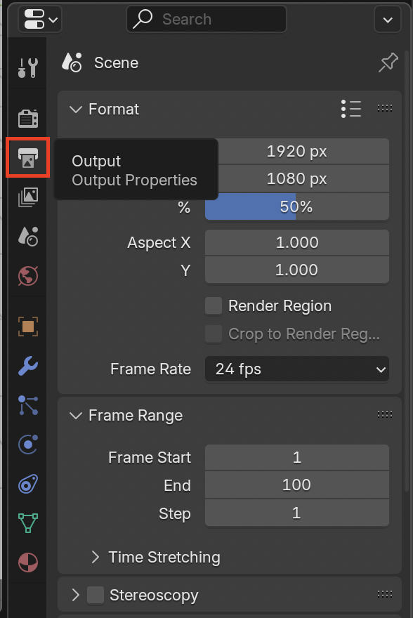
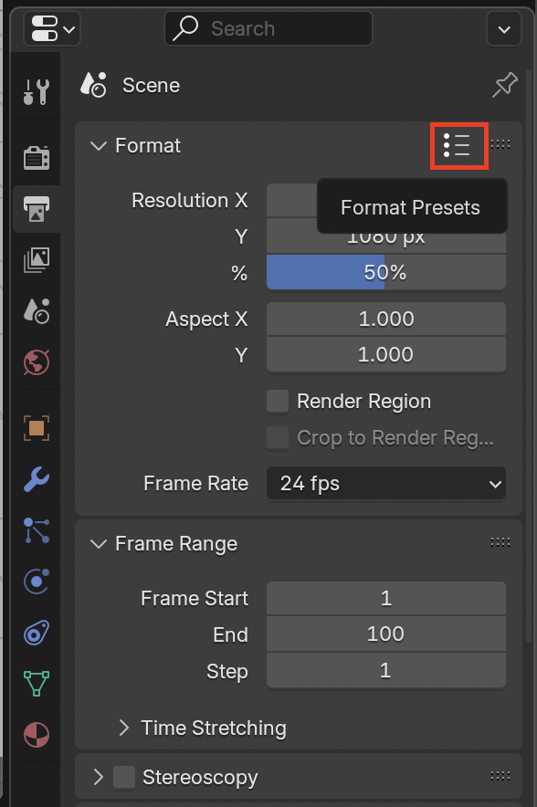
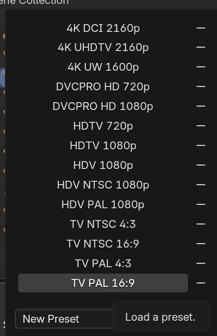
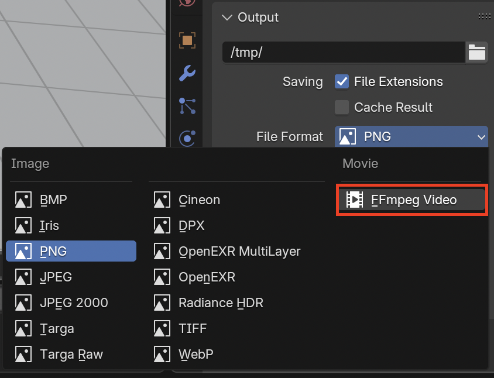

## Render settings

Before rendering the animation, let's decide how the final video will be saved.

--- task ---

+ On the right-hand panel, make sure you have selected the **Output Properties** tab.

--- /task ---

You need to change some settings as follows:

### The resolution

--- task ---

Go to **Dimensions**.

--- /task ---

Here you need to change the **Render Presets**, which define the resolution. For this tutorial you'll be using the TV PAL, which is the old television format.

--- task ---

Select **TV PAL 16:9**.

--- /task ---

**Tip:** If you select a higher resolution or frame rate, you will get a really good quality video but it will take a very long time to render. Blender can render in HD and 4K, but if you are rendering on a rather slow computer, then you should be picking a lower resolution with lower quality so you don't have to wait a very long time for the rendering to finish. For Hollywood movies, a single frame can take several hours!

### Number of frames

You can also set the number of frames per second for your movie.

--- task ---

Change the number of frames per second to 24.

--- /task ---

### The output location

This is where Blender will save your files.

--- task ---

Go to **Output**. By default, Blender saves your file in a `/tmp` folder, which will not be very helpful for finding it once it has been rendered.

--- /task ---

--- task ---

Change the location by clicking on the **Folder** icon, then select the folder where you wish to save your finished movie. Press the **Accept** button when you are done.

--- /task ---

So now you have PAL resolution, 24 frames per second, and you are saving to a location that you can access.

### The file format

Lastly, you need to set the file format to a video format.

--- task ---

Select the drop-down menu below where you type in the file name, and choose **FFmpeg video**, a format that you should be able to play on most computers.

There are lots of other possible settings you could change, but these settings should work for now.

--- /task ---
