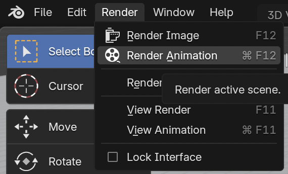

## Render

Now you are ready to render!
--- task ---

Click **Render** the top left of the screen and click on **Render Animation**.

--- /task ---
+ 
The computer is now creating hundreds of single images, then stitching them all together to make the film. For each step on the timeline, the computer will have to create one image, in this case 24 images (frames) per second.

--- task ---

Once the render has finished, go to the folder where you have stored the file. You should see the file of your four-second-long movie.

--- /task ---

--- task ---

Now play your movie!

--- /task ---
