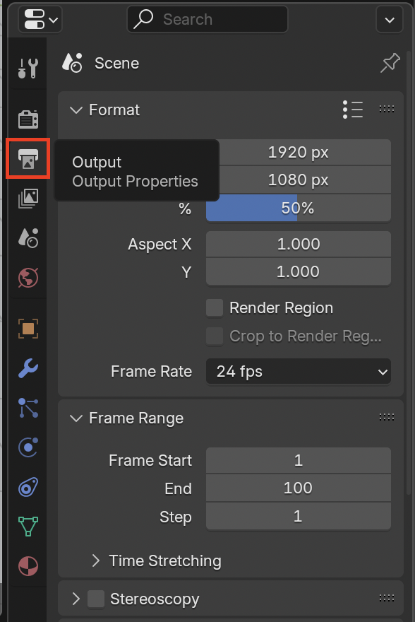
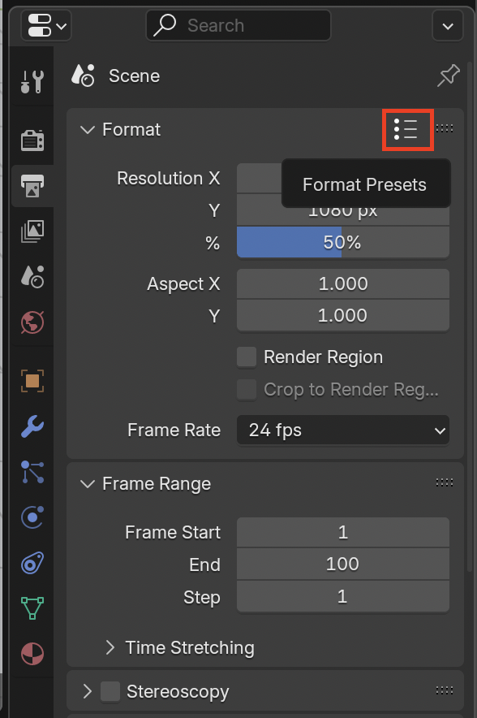
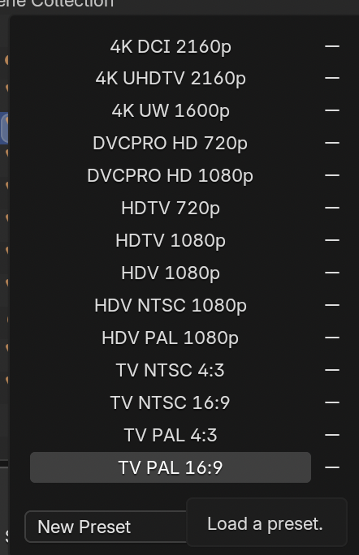
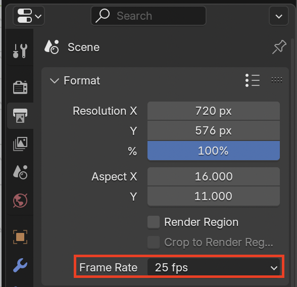
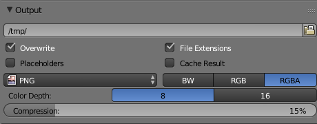
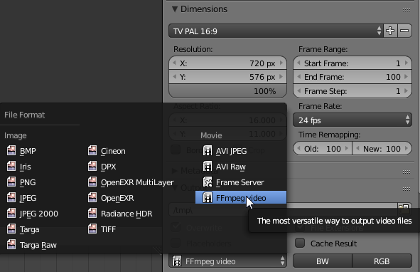

## Render settings

Let's render the animation.

+ On the right hand panel make sure the camera tab is selected.

You need to change some settings as follows:

### The resolution

+ Go to Dimensions

Here you need to change the **Render Presets** which define the resolution.
For this tutorial you'll be using the TV PAL, which is the old television format.

+ Select TV PAL 16:9.

If you select a higher resolution or frame rate you will a really good quality video but it will take a very long time to render. Blender can render in HD and 4K, but if you are rendering on a rather slow machine then you should be picking a lower resolution with lower quality to be able to render without a very long wait. For Hollywood movies a single frame can take several hours!

### Number of frames

You can also set the number of frames per second for your movie.

+ Change the number of frames per second to 24.

### The output location

This is where Blender will save your files.

+ Go to Output. By default Blender saves it in a `/tmp` folder which will not be very helpful for finding the file once it has rendered.

+ Change the location by clicking on the folder icon, then select the folder where you wish to save your finished movie. Press the **Accept** button when you are done.

So now you have PAL, 24 frames per second and you are saving to a location that you have access to.

## The file format

Lastly, you need to set the file format to a video format.

+ Select the dropdown underneath where you set the file name and choose **FFmpeg video**, a format that should run on most computers.

There are lots of other possible settings you could change, but these settings should work for now.
