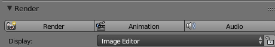

## Render

Let's get ready to render.

+ Scroll back to the top of the right hand panel and click on animation.

The computer is now creating hundreds of single images, then sticking them all together to make the film. There are 24 images (frames) per second. For each step on the timeline the computer will have to create one image.

You can see that the resolution is not high. If you zoom in you can see the pixels. If you use HD or 4K renders, the resolution would be much better but the computer would need more time to render the images.

Once the render finishes you can go to the location that you have set to store the file and you should see the movie file, which is 4 seconds long.

+ Now play your movie!
