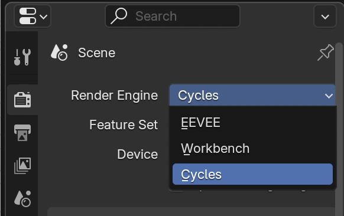

## Challenge: different settings

+ Try selecting different resolutions from the **render presets** menu and see how this changes the file size and time taken to render the scene.

+ Try rendering the scene in the **Cycles Render** by selecting it from the menu at the top of the screen.

Most professionals use this mode, but it can be really slow as it uses **ray tracing**. Ray tracing simulates the how light rays bounce around the scene. You can get super realistic images this way but you might need to buy a very expensive graphics card to do this.
