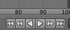
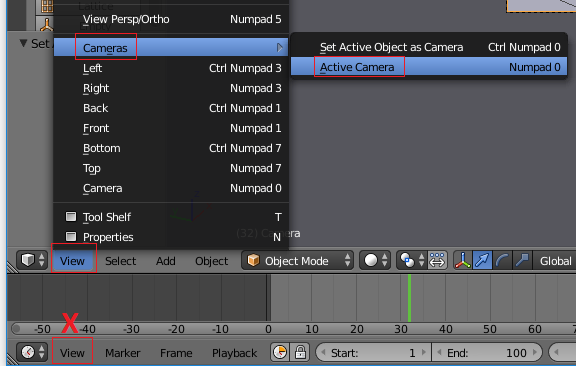

## अपने एनिमेशन की जाँच करें

इस परियोजना के लिए आपको [बर्फ के दृश्य का एनिमेशन करें](https://projects.raspberrypi.org/en/projects/blender-animate-snow-scene){:target="_blank"} संसाधन के साथ तैयार किए गए एनिमेशन की ज़रूरत होगी। यदि आपने इस संसाधन को पूरा नहीं किया है, तो आप इसके बजाय [प्रारंभक बर्फ दृश्य](resources/starter-snow-scene.blend){:target="_blank"} को डाउनलोड करके उसका उपयोग कर सकते हैं।

+ **Play** (प्ले) आइकन पर क्लिक करके या टाइमलाइन पर हरे रंग की पट्टी को हिलाकर अपने एनिमेशन को चलाएँ। जैसा यह दिखाई दे रहा है क्या आपको यह पसंद है?

+ इसके बाद, रेंडर व्यू में जाकर यह जांच करें कि क्या कैमरा सही स्थान पर है: <kbd>F12</kbd> दबाएं (<kbd>FN + F12</kbd> दबाएं, यदि आप Mac का उपयोग कर रहे हैं तो)। जब आप इस दृश्य से बाहर निकलना चाहें तो <kbd>Esc</kbd> दबाएँ।

आप **कैमरे** की स्थिति से यह भी देख सकते हैं कि पूर्ण एनिमेशन कैसा दिखाई देगा।

+ यदि आप डेस्कटॉप कंप्यूटर का उपयोग कर रहे हैं, तो नमपैड (आपके कीबोर्ड के दाईं ओर संख्या कुंजी का छोटा सेट) पर `0` दबाएँ। लैपटॉप में नमपैड नहीं होता है, इसलिए इसके बजाय मेनू से **View** > **Cameras** चुनें, फिर **Active camera** का चयन करें।

सावधान रहें कि संपादक विंडो के सबसे नज़दीक वाले दृश्य मेनू का उपयोग करना है और स्क्रीन के बिल्कुल नीचे (ऊपर दिए गए स्क्रीनशॉट में X से चिह्नित) वाले मेनू का **नहीं**।

+ कैमरे के ज़रिए दिखाई देने वाले एनिमेशन को चलाने के लिए **Play** आइकन पर क्लिक करें।

+ `0` को दबाकर या **Active camera** मेनू विकल्प का फिर से चयन करके दृश्य से बाहर निकलें।

अगर आप एनिमेशन से खुश हैं और कैमरे के दृष्टि से सबकुछ ठीक दिखता है, तो आप अपने दृश्य को प्रस्तुत करने के लिए तैयार हैं।