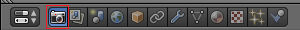
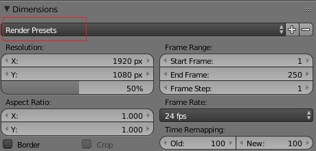
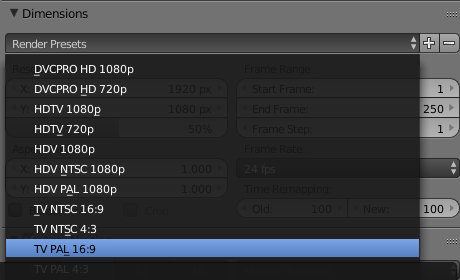
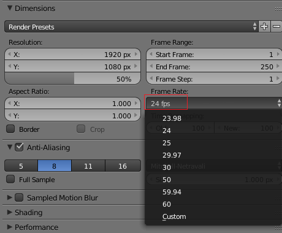
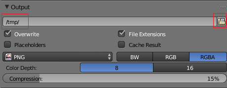
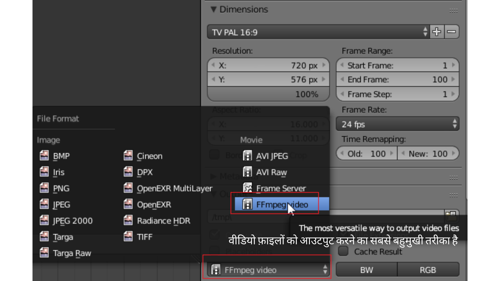

## सेटिंग्स प्रस्तुत करें

एनिमेशन प्रस्तुत करने से पहले, आइए तय करें कि अंतिम वीडियो कैसे सहेजा जाएगा।

+ दाएं हाथ के पैनल पर, सुनिश्चित करें कि आपने **कैमरा** चुना है।

आपको कुछ सेटिंग्स को निम्नानुसार बदलना होगा:

### रेज़ोल्यूशन

+ **Dimensions** पर जाएँ।

यहाँ आपको **Render Presets** को बदलने की आवश्यकता होगी, जो रेज़ोल्यूशन को परिभाषित करते हैं। इस ट्यूटोरियल के लिए आप TV PAL का उपयोग करेंगे, जो पुराना टेलीविज़न फॉर्मेट है।

+ **TV PAL 16:9** चुनें।

यदि आप उच्च रेज़ोल्यूशन या फ्रेम रेट का चयन करते हैं, तो आप वास्तव में एक अच्छी गुणवत्ता वाला वीडियो देखेंगे लेकिन इसे प्रस्तुत करने में बहुत अधिक समय लगेगा। Blender HD और 4K में प्रस्तुत कर सकता है, लेकिन यदि आप प्रस्तुति किसी धीमे कंप्यूटर पर कर रहे हैं, तो आपको कम गुणवत्ता वाले कम रेज़ोल्यूशन को चुनना चाहिए ताकि आपको प्रस्तुति समाप्त करने के लिए बहुत अधिक समय तक इंतजार न करना पड़े। हॉलीवुड की फिल्मों के लिए, एक फ्रेम में कई घंटे लग सकते हैं!

### फ्रेमों की संख्या

आप अपनी फिल्म के लिए प्रति सेकंड फ्रेम की संख्या भी सेट कर सकते हैं।

+ प्रति सेकंड फ़्रेम की संख्या को बदल कर 24 करें।

### आउटपुट स्थान

यह वह स्थान है जहाँ Blender आपकी फाइलें सहेजेगा।

+ **Output** पर जाएँ। डिफ़ॉल्ट रूप से, ब्लेंडर आपकी फ़ाइल को `/tmp` फ़ोल्डर में सहेजता है, जो इसे प्रस्तुत करने के बाद इसे खोजने के लिए बहुत उपयोगी नहीं होगा।

+ **Folder** (फ़ोल्डर) आइकन पर क्लिक करके स्थान बदलें, फिर वह फ़ोल्डर चुनें जहाँ आप अपनी तैयार फिल्म को सहेजना चाहते हैं। जब आप पूरा कर लें तो **Accept** बटन दबाएँ।

तो अब आपके पास PAL रेज़ोल्यूशन है, यह 24 फ्रेम प्रति सेकंड है, और आप उस स्थान पर सहेज रहे हैं जिसे आप एक्सेस कर सकते हैं।

### फ़ाइल फॉर्मेट

अंत में, आपको फ़ाइल फॉर्मेट को किसी वीडियो फॉर्मेट में सेट करना होगा।

+ नीचे दिए गए ड्रॉप-डाउन मेनू का चयन करें जहाँ आप फ़ाइल नाम टाइप करते हैं, और **FFmpeg video** चुनें, इस फ़ॉर्मेट को आप अधिकतर कंप्यूटरों पर चला सकेंगे।

अन्य बहुत सी संभावित सेटिंग्स हैं जिन्हें आप बदल सकते हैं, लेकिन फिलहाल यही सेटिंग्स ठीक रहेंगी।