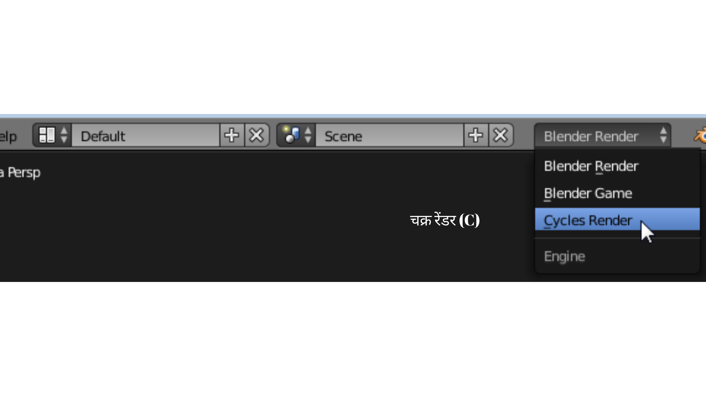

## चुनौती: विभिन्न सेटिंग्स

+ Try selecting different resolutions from the **Render presets** menu and see how this changes the file size and the time Blender needs to render the scene.

+ स्क्रीन के शीर्ष पर मेनू से **Cycles Render** मोड को चुनकर दृश्य को उसमें प्रस्तुत करने का प्रयास करें।

अधिकतर पेशेवर इस मोड का उपयोग करते हैं, लेकिन यह बहुत ही धीमा हो सकता है क्योंकि इसमें **ray tracing** का उपयोग किया जाता है। रे ट्रेसिंग सिमुलेट करता है कि प्रकाश की किरणें दृश्य के चारों ओर कैसे उछलती हैं। इस तरीके से आप बहुत बढ़िया वास्तविक छवियाँ प्राप्त कर सकते हैं, लेकिन **Cycles Render** मोड का उपयोग करने के लिए बहुत अधिक कंप्यूटिंग शक्ति चाहिए होती है, इसके लिए आपको बहुत अधिक महंगा ग्राफ़िक कार्ड खरीदने की ज़रूरत पड़ सकती है ताकि वह आपके कंप्यूटर पर काम कर सके।