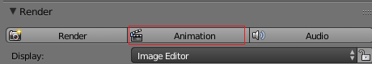

## प्रस्तुत करें

अब आप प्रस्तुत करने के लिए तैयार हैं!

+ दाईं ओर के पैनल के शीर्ष पर वापस स्क्रॉल करें और **Animation** (एनिमेशन) पर क्लिक करें।

कंप्यूटर अब सैकड़ों एकल छवियाँ बना रहा है, फिर फिल्म बनाने के लिए उन सभी को एक साथ जोड़ रहा है। टाइमलाइन पर प्रत्येक चरण के लिए, कंप्यूटर को एक छवि बनानी होगी, इस मामले में प्रति सेकंड 24 छवियाँ (फ्रेम)।

आप देखेंगे कि रेज़ोल्यूशन उच्च नहीं है: यदि आप ज़ूम इन करते हैं, तो आप पिक्सल देख सकते हैं। यदि आपने HD या 4K रेंडरिंग सेटिंग्स चुनी थी, तो वीडियो का रेज़ोल्यूशन बहुत बेहतर होगा, लेकिन आपके कंप्यूटर को इसे प्रस्तुत करने के लिए बहुत अधिक समय चाहिए होगा।

एक बार प्रस्तुत करना समाप्त हो जाने के बाद, उस फ़ोल्डर पर जाएँ जहाँ आपने फ़ाइल संगृहीत की है। आपको अपनी चार-सेकंड-लंबी फिल्म की फ़ाइल देखनी चाहिए।

+ अब अपनी फिल्म चलाएँ!