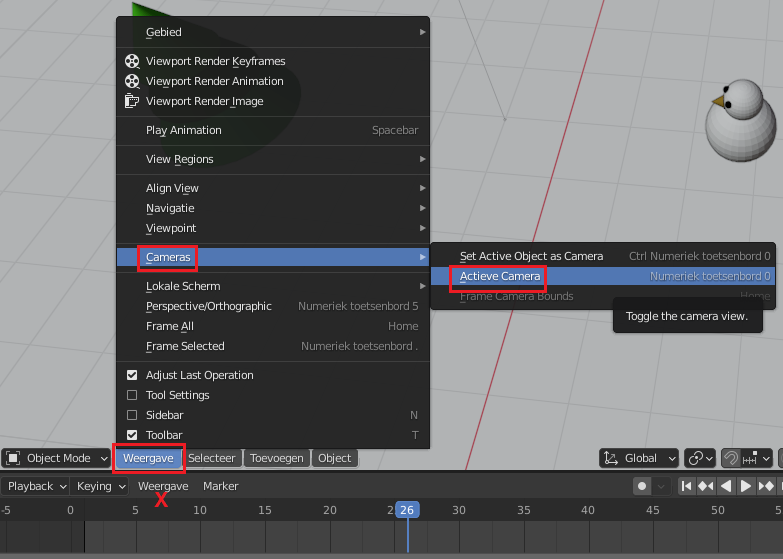

## Controleer je animatie

Voor dit project heb je de animatie nodig die je hebt gemaakt in het [Animeer een sneeuwscène](https://projects.raspberrypi.org/en/projects/blender-animate-snow-scene){:target="_blank"} project. Als je deze bron niet hebt voltooid, kun je in plaats daarvan de [startsneeuwscène](resources/starter-snow-scene.blend){:target="_blank"} downloaden en gebruiken.

+ Speel je animatie af door te klikken op het **Afspelen** pictogram of door de blauwe balk op de tijdlijn te verplaatsen. Hoe vind je dat het eruit ziet?

+ Controleer vervolgens of de camera op de juiste locatie staat door naar de renderweergave te gaan: druk op <kbd>F12</kbd> (<kbd>FN + F12</kbd>, als je een Mac gebruikt). Druk op <kbd>Esc</kbd> als je deze weergave wilt verlaten.

Je kunt ook controleren hoe de volledige animatie eruit ziet vanaf de positie van de **camera**.

+ Als je een desktopcomputer gebruikt, druk op `0` op het numerieke toetsenblok (de kleine set cijfertoetsen aan de rechterkant van je toetsenbord). Laptops hebben geen numerieke toetsenblokken, dus selecteer in plaats daarvan **Weergave** > **Cameras** in het menu en selecteer vervolgens **Actieve camera**.

Wees voorzichtig en gebruik het weergave menu dicht bij het editor venster en **niet** degene aan de onderkant van het scherm (gemarkeerd met een X in de schermafbeelding hierboven).

+ Klik op het **Afspelen** pictogram om de animatie af te spelen zoals gezien door de camera.

+ Verlaat de weergave door op `0` te drukken of door de **Actieve camera** opnieuw te selecteren.

Als je tevreden bent met de animatie en alles er goed uitziet vanuit het perspectief van de camera, dan ben je klaar om je scène te renderen.