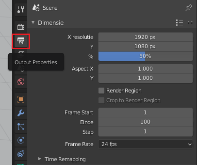
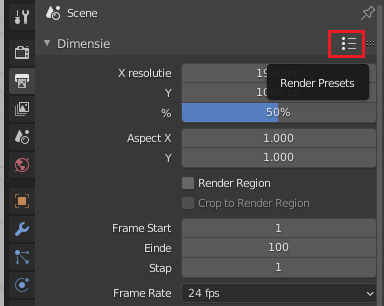
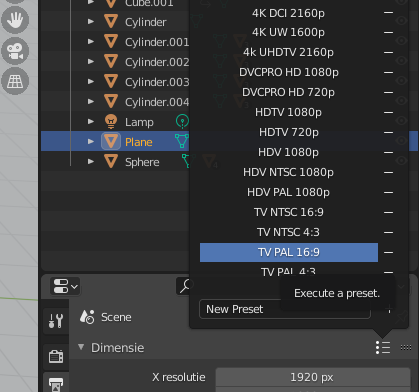
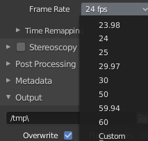
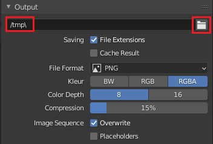
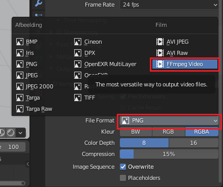

## Render-instellingen

Laten we, voordat we de animatie renderen, beslissen hoe de uiteindelijke video wordt opgeslagen.

+ Zorg ervoor dat je in het rechterpaneel het tabblad **Output Properties** (uitvoereigenschappen) hebt geselecteerd.

Je moet enkele instellingen als volgt wijzigen:

### De resolutie

+ Ga naar **Dimensie**.

Hier moet je de **Render Presets** wijzigen, die de resolutie bepalen. Voor dit project gebruik je TV PAL, het oude televisieformaat.

+ Selecteer **TV PAL 16:9**.

Als je een hogere resolutie of framesnelheid selecteert, krijg je een video van echt goede kwaliteit, maar het duurt erg lang om deze weer te geven. Blender kan renderen in HD en 4K, maar als je rendert op een nogal trage computer, dan zou je een lagere resolutie met een lagere kwaliteit moeten kiezen, zodat je niet erg lang hoeft te wachten voordat het renderen is voltooid. Voor Hollywood-films kan een enkel beeld enkele uren duren!

### Aantal beelden

Je kunt ook het aantal beelden per seconde instellen voor je film.

+ Wijzig het aantal beelden per seconde (frame rate) naar 24.

### De uitvoerlocatie

Dit is waar Blender je bestanden opslaat.

+ Ga naar **Output** (uitvoer). Standaard slaat Blender je bestand op in een `/tmp` map, wat niet erg handig is om het terug te vinden als het eenmaal is gerenderd.

+ Verander de locatie door op het **Map** pictogram te klikken en selecteer vervolgens de map waar je de voltooide film wilt opslaan. Druk op de **Accepteer** knop wanneer je klaar bent.

Dus nu heb je PAL-resolutie, 24 beelden per seconde, en je slaat op op een locatie waar je toegang toe hebt.

### Het bestandsformaat

Ten slotte moet je het bestandsformaat instellen op een videoformaat.

+ Selecteer het uitklapmenu vlak onder waar je de bestandsnaam typt en kies **FFmpeg video**, een formaat dat je op de meeste computers moet kunnen afspelen.

Er zijn tal van andere mogelijke instellingen die je zou kunnen wijzigen, maar deze instellingen zouden voorlopig moeten werken.