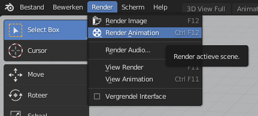

## Renderen

Nu ben je klaar om te renderen!

+ Klik **Render** in de linkerbovenhoek van het scherm en klik op **Render Animation** (animatie weergeven).

De computer maakt nu honderden afzonderlijke afbeeldingen en naait ze allemaal aan elkaar om de film te maken. Voor elke stap op de tijdlijn moet de computer één afbeelding maken, in dit geval 24 afbeeldingen (beelden) per seconde.

Je zult zien dat de resolutie niet hoog is: als je inzoomt, kun je de pixels zien. Als je HD- of 4K-weergave-instellingen had gekozen, zou de resolutie van de video veel beter zijn, maar zou je computer veel meer tijd nodig hebben om deze te renderen.

Als het renderen klaar is, ga dan naar de map waar je het bestand hebt opgeslagen. Je zou het bestand van je vier seconden durende film moeten zien.

+ Speel nu je film af!