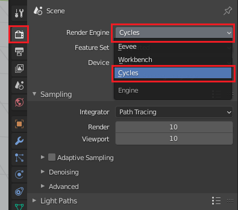

## Uitdaging: andere instellingen

+ Probeer verschillende resoluties te selecteren uit het **Render Presets** menu en kijk hoe dit de bestandsgrootte verandert en de tijd die Blender nodig heeft om de scène te renderen.

+ Probeer de scène te renderen in de **Cycles Render** modus door deze te selecteren in het menu bovenaan het scherm.

De meeste professionals gebruiken deze modus, maar het kan erg langzaam zijn omdat het **ray tracing** gebruikt. Ray tracing simuleert hoe lichtstralen door de scène weerkaatsen. Je kunt op deze manier superrealistische afbeeldingen krijgen, maar het gebruik van de **Cycles Render** modus vereist veel rekenkracht, dus je moet mogelijk een erg dure grafische kaart kopen om dit op je computer te laten werken.